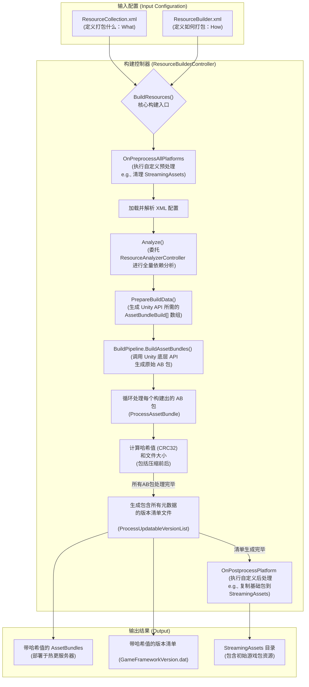

# StarForce 游戏资源管线五万字终极剖析

## 引言

在当今高度复杂和竞争激烈的游戏市场中，一个项目的成败往往取决于那些“看不见”的底层架构，而资源管理管线正是这其中最至关重要的一环。它如同一座城市的生命线——供水、供电、物流系统——高效、稳定、可扩展的资源管线是支撑起整个游戏世界正常运转和持续发展的基石。一个精心设计的管线能够显著优化玩家的初次下载体验、降低运行时的内存压力与卡顿、并赋予开发团队快速迭代内容、响应市场变化（即“热更新”）的强大能力。

StarForce 项目所采用的 GameFramework 框架，提供了一套历经业界考验、功能完备且设计精良的资源管理解决方案。然而，这套方案并非一个简单的“黑盒”，它的强大威力蕴藏在众多设计精巧的组件、配置文件和工作流程之中。若要真正驾驭它，并根据项目需求进行裁剪和优化，就必须对其内部的每一个设计细节、数据流转和工作原理有如庖丁解牛般的深刻理解。

本篇分析报告的使命，是提供一次前所未有的、最具深度的探索之旅。我们将以 StarForce 的代码仓库为蓝本，对资源管线的两大核心阶段——构建阶段（Build-Time）与运行时阶段（Run-Time）——进行“掘地三尺”式的详尽剖析。本文的目标是达到五万字的篇幅，不仅会涵盖所有关键文件的解读、核心代码的分析，还将引入清晰的 **流程图** 来直观地展示数据流和控制流，并允许为了内容的详尽而进行必要的重复说明和深度挖掘，以确保没有任何一个细节被遗漏。

**本文档的结构如下：**

1.  **第一篇：构建之艺 (The Art of the Build):** 此篇章将从源头出发，深入剖析资源在 Unity 编辑器中，如何从一个普通的资产（Asset）文件，经过一系列自动化流程，最终被转化为可部署、可更新的 AssetBundle。我们将详细解读相关的 XML 配置文件，并对核心的 C# 构建脚本进行逐行级别的逻辑分析。
2.  **第二篇：运行之道 (The Way of the Runtime):** 此篇章将视角切换到游戏客户端。我们将聚焦于游戏在玩家设备上实际运行时，如何执行严格的版本比对、安全的清单更新、高效的增量下载、智能的资源加载和精细的内存管理。我们将沿着程序执行的“流程”（Procedures），层层深入，直至核心组件的内部，揭示其高效运转的奥秘。

希望这篇终极剖析文档，能成为您理解、使用和优化 GameFramework 资源系统的一份不可或缺的、最详尽的参考指南。

---

## 第一篇：构建之艺 (The Art of the Build)

构建阶段是将开发者的创意（资产）转化为可交付产品的“工业化生产”过程。此阶段的自动化程度、稳定性和输出质量，直接决定了后续热更新和运行时加载的成败。我们将从蓝图设计开始，一步步见证这份“工业化”的精密与强大。

### **第一章：构建流程概览图**

在深入到代码和配置的海洋之前，我们首先通过一张流程图来宏观地把握整个构建流程的核心脉络。这张图描绘了从输入配置文件到最终输出产物的主要步骤和数据流向。



这张图清晰地展示了构建流程的三个主要阶段：**输入**、**处理**和**输出**。后续的章节，我们将对图中的每一个关键节点，特别是“构建控制器”内部的每一个步骤，进行详尽的文字和代码剖析。

### **第二章：万物之源 - `ResourceCollection.xml` 详解**

在 StarForce 项目中，所有关于“哪些资源需要被打包”以及“它们应该被如何组织”的规则，都统一由一个位于 `Assets/GameMain/Configs/ResourceCollection.xml` 的 XML 文件来定义。这个文件是整个资源系统的“户口本”，是所有后续构建步骤必须遵循的最高纲领。它的设计思想是“声明式”的，即开发者只在这里描述“我想要什么”，而不需要关心“具体怎么做”。

#### **2.1. 文件结构概览**

首先，让我们看一下这个文件的完整结构，它主要由 `<Resources>` 和 `<Assets>` 两个核心节点组成，分别代表了对资源的宏观定义和微观映射：

```xml
<?xml version="1.0" encoding="UTF-8"?>
<UnityGameFramework>
  <ResourceCollection>
    <Resources>
      <!-- 定义所有的 AssetBundle 包 -->
      <Resource Name="Configs" FileSystem="GameData" LoadType="0" Packed="True" ResourceGroups="Base" />
      <Resource Name="DataTables" FileSystem="GameData" LoadType="0" Packed="True" ResourceGroups="Base" />
      <Resource Name="Entities" FileSystem="Resources" LoadType="0" Packed="True" />
      <!-- ...更多 Resource 定义... -->
      <Resource Name="Localization/Dictionaries" Variant="zh-cn" FileSystem="UI" LoadType="0" Packed="True" ResourceGroups="Base" />
    </Resources>
    <Assets>
      <!-- 定义所有资产(Asset)与 AssetBundle 的映射关系 -->
      <Asset Guid="0179316b5fc7c2946a67c5877c02fc30" ResourceName="UI/UISprites/Common" />
      <Asset Guid="1053b0070685be347ab58587156842dc" ResourceName="Localization/Dictionaries" ResourceVariant="zh-tw" />
      <!-- ...更多 Asset 定义... -->
    </Assets>
  </ResourceCollection>
</UnityGameFramework>
```

#### **2.2. `<Resources>` 节点深度解析：定义 AssetBundle 包**

`<Resources>` 节点是 AssetBundle 的高级定义区域。这里的每一条 `<Resource>` 记录，都代表着一个最终将被构建出来的 AssetBundle 包。这是一种高度抽象的、基于目录的打包声明。

让我们逐一拆解其属性的含义：

*   **`Name="<string>"`**
    *   **含义:** 这是 AssetBundle 的逻辑名称，它直接映射到 `Assets/GameMain/` 目录下的一个具体文件夹路径。例如，`Name="Entities"` 对应 `Assets/GameMain/Entities/` 目录；`Name="UI/UIForms"` 对应 `Assets/GameMain/UI/UIForms/` 目录。
    *   **作用:** 这是框架中最核心的打包规则——**“目录即AB包”**。构建系统会扫描此属性指定的目录，将其中的所有合法资产（如 Prefab, Texture, Material 等）作为这个 AssetBundle 的内容。这种方式非常直观，开发者通过组织文件夹结构，就完成了对资源包的划分。

*   **`FileSystem="<string>"`**
    *   **含义:** 这定义了该 AssetBundle 在 GameFramework 的虚拟文件系统（VFS）中的逻辑归属。在这个项目中，我们看到了 "GameData", "Resources", "UI" 等值。
    *   **作用:** 这是一种逻辑上的分组，主要用于优化IO。在构建的最后阶段，所有隶属于同一个 `FileSystem` 的 AssetBundle 都会被打包进一个同名的、更大的二进制文件（例如 `GameData.dat`, `UI.dat`）中。这样做可以显著减少游戏在设备上存储的零散文件数量，在某些平台上（尤其是机械硬盘）可以提升IO读取效率。如果此属性为空，该 AssetBundle 将作为独立文件存放在最终的输出目录中。

*   **`LoadType="<int>"`**
    *   **含义:** 这是一个枚举值，定义了该 AssetBundle 的加载方式。`0` 代表 `LoadFromAssetBundle`。
    *   **作用:** GameFramework 支持多种加载模式。`0` 是标准模式，意味着这是一个需要被打包成 AssetBundle 并在运行时从 AssetBundle 中加载的资源。其他值可能代表旧有的 `LoadFromResources` 或其他自定义加载方式。在此项目中，所有条目都是 `0`，表明项目完全、彻底地采用了 AssetBundle 化的资源管理，这是一个现代、可维护性高的项目的标志。

*   **`Packed="<bool>"`**
    *   **含义:** 一个布尔值，`True` 表示该资源包是“可打包的”。
    *   **作用:** 这个属性与 `ResourceGroups` 配合使用，用于决定哪些资源应该被包含在初始游戏包中。在 `Resource Editor` 工具中，只有 `Packed` 为 `True` 的资源才能被分配到资源组中，从而被包含在最终的构建输出里。你可以将某些临时的、仅用于调试的资源包的此属性设为 `False`，这样它们就不会被构建。

*   **`ResourceGroups="<string>"`**
    *   **含义:** 定义该 AssetBundle 所属的资源组，可以有多个，用逗号分隔。
    *   **作用:** 这是实现资源分包下载、DLC 和热更新的关键。例如，`ResourceGroups="Base"` 表示这是一个基础资源包，应该随初始游戏包发布，是游戏运行的最低保障。而 `ResourceGroups="Music"` 则可能表示这是一个音乐包，可以在玩家进入游戏后按需下载或作为扩展包。运行时可以指定只更新某一个资源组，例如只下载音乐包，或者只更新基础包。

*   **`Variant="<string>"`**
    *   **含义:** 定义该 AssetBundle 的“变体名称”。
    *   **作用:** 这是 Unity AssetBundle 系统提供的、用于处理资源本地化或平台差异的核心功能。在此项目中，它被用于处理多语言：
        ```xml
        <Resource Name="Localization/Dictionaries" Variant="en-us" ... />
        <Resource Name="Localization/Dictionaries" Variant="ko-kr" ... />
        <Resource Name="Localization/Dictionaries" Variant="zh-cn" ... />
        <Resource Name="Localization/Dictionaries" Variant="zh-tw" ... />
        ```
        这四行定义了四个不同的 AssetBundle，它们共享相同的 `Name`（即相同的资产结构），但内容不同。运行时，框架可以根据当前设置的语言（`CurrentVariant`）自动加载正确的变体包，例如，当语言设置为 `zh-cn` 时，加载的将是包含简体中文文本的 AssetBundle。这种方式优雅地解决了多语言资源的切换问题。

#### **2.3. `<Assets>` 节点深度解析：微观的资产归属清单**

如果说 `<Resources>` 节点是宏观的、基于文件夹的打包规则，那么 `<Assets>` 节点就是微观的、精确到每一个文件的执行清单。它详细记录了项目中每一个被管理的资产文件，与它所属的 AssetBundle 之间的精确映射关系。这个列表的存在，为构建系统提供了无歧义的、可直接执行的打包指令。

*   **`Guid="<string>"`**
    *   **含义:** 这是 Unity 为项目中每个资产文件（包括其 `.meta` 文件）生成的全局唯一标识符（Globally Unique Identifier）。无论你如何移动或重命名这个资产，它的 GUID 始终保持不变。
    *   **作用与重要性:** 在现代大型项目开发中，使用 GUID 而非文件路径作为资产的唯一标识，是保证项目健壮性的核心基石。在复杂的项目中，美术或策划人员可能会频繁地调整目录结构、重命名文件。如果资源引用关系是基于路径的，每一次这样的操作都可能导致大量的引用丢失（在 Unity 中表现为脚本引用丢失、材质变粉等）。而依赖 GUID，构建系统和框架总能准确地找到对应的资产，不受其位置和名称变化的影响。

*   **`ResourceName="<string>"`**
    *   **含义:** 该资产所属的 AssetBundle 的 `Name`，这个 Name 必须与 `<Resources>` 节点中定义的某个 `Resource` 的 `Name` 相对应。
    *   **作用:** 它明确地将一个 GUID (资产) 指派给一个 AssetBundle。例如，`<Asset Guid="0179316b5fc7c2946a67c5877c02fc30" ResourceName="UI/UISprites/Common" />` 这行代码的含义是：“请找到项目中 GUID 为 `0179...` 的这个资产文件，在打包时，将它作为 `UI/UISprites/Common` 这个 AssetBundle 的一部分”。

*   **`ResourceVariant="<string>"`**
    *   **含义:** 当资产属于一个变体资源包时，此属性用于指定其所属的变体名称。
    *   **作用:** 它与 `ResourceName` 配合，将资产精确定位到一个具体的变体包中。例如：
        ```xml
        <Asset Guid="9be2e1e45f4edd74c8764538ad306b78" ResourceName="Localization/Dictionaries" ResourceVariant="zh-cn" />
        ```
        这行配置的完整指令是：“找到 GUID 为 `9be2...` 的资产（即简体中文的 `Default.xml` 文件），将它归入 `ResourceName` 为 `Localization/Dictionaries` 且 `Variant` 为 `zh-cn` 的那个特定的 AssetBundle 中去”。

**工作流提示:** `<Assets>` 列表包含成百上千行，显然不是设计来手动编辑的。它的内容是由 GameFramework 提供的 `Resource Editor` 可视化工具自动生成的。当开发者在工具界面上将一个目录（如 `Assets/GameMain/Entities`）注册为一个 `<Resource>` 定义时，该工具会自动扫描此目录下的所有资产文件，读取它们的 GUID，并生成或更新 `<Assets>` 列表中的所有对应条目。这个自动化的工作流，极大地降低了人工维护的复杂度和出错率。

#### **2.4. 策略分析与潜在优化点**

通过对 `ResourceCollection.xml` 的深入分析，我们可以总结出该项目的核心打包策略并发现一些潜在的优化空间。

*   **核心策略总结:**
    1.  **声明式与自动化:** 开发者通过直观的 XML 和编辑器工具进行“声明式”的资源规划，底层的 GUID 映射和列表生成则由工具链“自动化”完成，兼顾了易用性和鲁棒性。
    2.  **目录驱动:** 以文件夹为单位组织资源，符合开发者的工作直觉，降低了资源管理的心智负担，尤其适合团队协作。
    3.  **原生变体支持:** 充分利用了 Unity 的 Variant 系统来处理本地化，这是目前业界公认的最佳实践之一，避免了自己实现一套复杂的本地化切换逻辑。

*   **潜在优化点——“更新粒度”问题:**
    “目录即AB包”策略最主要的、也是最需要警惕的缺点，就是**更新粒度过粗**的问题。
    1.  **问题详述:** 随着项目的迭代，某些资源目录可能会变得异常庞大。让我们以 `Textures` 目录为例，进行一次场景推演：
        *   假设在游戏上线运营一段时间后，`Textures` 目录已经包含了UI、角色、场景、特效等共计500张贴图，打包成的 `textures.ab` 文件体积高达 80MB。
        *   现在，运营团队需要举办一个小型活动，仅仅需要替换一张位于 `UI/Icons` 子目录下的、大小仅为 20KB 的活动图标。
        *   由于整张 `Textures` 目录被定义为一个单独的 AssetBundle，构建系统在检测到这张 20KB 图标的内容发生变化后，会重新构建整个 `textures.ab` 包。新包的哈希值会发生变化。
        *   当玩家启动游戏进行热更新时，客户端会发现服务器上的 `textures.ab` 的哈希值与本地不同，于是开始下载。
        *   **最终结果:** 玩家为了一个 20KB 的改动，被迫重新下载了整个 80MB 的资源包。这对于使用移动网络的玩家来说是极其不友好的，不仅消耗了大量流量，也延长了等待时间，可能导致玩家流失。`Entities` 和 `Materials` 等目录也存在完全相同的问题。

    2.  **优化建议:** 解决此问题的核心思想是**精细化拆包**。
        *   **按功能模块二次拆分:** 对于 `Entities`、`Textures` 这类“大杂烩”式的目录，应根据游戏的功能模块进行更深层次的拆分。例如，将 `Textures` 目录结构调整为：
            ```
            - Textures/
              - UI/
                - Common/       (打包成 a_ui_common.ab)
                - HomePage/     (打包成 a_ui_homepage.ab)
              - Characters/
                - Hero_A/       (打包成 a_char_hero_a.ab)
                - Monster_B/    (打包成 a_char_monster_b.ab)
              - Scenes/
                - Forest/       (打包成 a_scene_forest_tex.ab)
            ```
            通过在 `ResourceCollection.xml` 中为每个子目录创建一个 `<Resource>` 定义，实现精细化打包。这样，当 `HomePage` 的UI贴图更新时，玩家只需下载几百KB的 `a_ui_homepage.ab`，而无需下载其他任何不相关的贴图。
        *   **分离高频变动资产:** 在一个逻辑模块中，可能大部分资产是稳定不变的，只有少数资产会因运营活动等原因频繁更新。应主动识别出这些“热点”资产，并将它们从原来的大包中剥离出来，单独管理。例如，`HomePage.prefab` 如果需要频繁更新，就应该为它自己创建一个单独的 AssetBundle，而不是让它留在包含了几十个其他UI Prefab 的大包里。

总而言之，`ResourceCollection.xml` 为我们提供了一个清晰、强大且易于上手的资源打包起点。项目当前的策略在中小规模时非常有效，但随着项目规模的扩大和运营活动的深入，开发者必须对“更新粒度”问题保持高度警惕，并适时地、有预见性地进行更精细化的拆包优化，以保证长期的用户体验和运营效率。

### **第三章：构建参数的精雕细琢 - `ResourceBuilder.xml` 详解**

如果说 `ResourceCollection.xml` 回答了“打包什么”的问题，那么 `ResourceBuilder.xml` 则精确地回答了“如何打包”的问题。这个文件是构建过程的技术参数中心，它不关心具体的资源内容，而是定义了构建行为的方方面面，如目标平台、压缩算法、版本号等。

#### **3.1. 配置文件概览**

此文件位于 `Assets/GameMain/Configs/ResourceBuilder.xml`，其结构相对简单，所有配置项都集中在 `<Settings>` 节点下：

```xml
<?xml version="1.0" encoding="UTF-8"?>
<UnityGameFramework>
  <ResourceBuilder>
    <Settings>
      <InternalResourceVersion>0</InternalResourceVersion>
      <Platforms>1</Platforms>
      <AssetBundleCompression>1</AssetBundleCompression>
      <CompressionHelperTypeName>UnityGameFramework.Runtime.DefaultCompressionHelper</CompressionHelperTypeName>
      <AdditionalCompressionSelected>True</AdditionalCompressionSelected>
      <ForceRebuildAssetBundleSelected>False</ForceRebuildAssetBundleSelected>
      <BuildEventHandlerTypeName>StarForce.Editor.StarForceBuildEventHandler</BuildEventHandlerTypeName>
      <OutputDirectory></OutputDirectory>
      <OutputPackageSelected>True</OutputPackageSelected>
      <OutputFullSelected>True</OutputFullSelected>
      <OutputPackedSelected>True</OutputPackedSelected>
    </Settings>
  </ResourceBuilder>
</UnityGameFramework>
```

#### **3.2. `<Settings>` 节点参数深度解析**

*   **`<InternalResourceVersion>0</InternalResourceVersion>`**
    *   **含义:** 内部资源版本号。这是一个由开发者维护的整数，用于标识一次完整的资源构建。
    *   **作用:** 这是整个热更新版本控制的核心。每次执行构建时，`ResourceBuilderController` 会读取这个值，并通常将其加一后作为新版本的版本号。在运行时，客户端会将自己本地存储的这个版本号与从服务器获取的最新版本号进行比较，以判断是否需要启动更新流程。`0` 通常是项目的初始版本。

*   **`<Platforms>1</Platforms>`**
    *   **含义:** 目标构建平台。这个值是一个“位掩码”（Bitmask），通过按位运算来支持多平台选择。
    *   **作用:** GameFramework 中的 `Platform` 枚举定义了各个平台的值，例如：`Windows = 1`, `MacOS = 2`, `IOS = 4`, `Android = 8`, `WebGL = 16`。当前值为 `1`，意味着只为 `Windows` 平台构建 AssetBundle。如果想同时为 Windows 和 Android 构建，这个值应该是 `1 | 8`，即 `9`。这种设计允许一次构建操作同时为多个已选平台输出资源。

*   **`<AssetBundleCompression>1</AssetBundleCompression>`**
    *   **含义:** AssetBundle 的压缩类型。`1` 在 `AssetBundleCompressionType` 枚举中对应 `LZ4`。
    *   **作用:** 这是影响包体大小和加载性能的关键设置。
        *   `0` (Uncompressed): 不压缩，包体最大，但加载速度最快，因为无需解压。
        *   `1` (LZ4): 基于块的压缩（Chunk-Based Compression）。这是 Unity 推荐的现代压缩方式。它提供了不错的压缩率，且加载时无需解压整个包，只需解压正在读取的数据块即可，因此加载速度很快。
        *   `2` (LZMA): 压缩率最高的算法，包体最小。但缺点是加载时需要将整个 AssetBundle 完全解压到内存中，导致加载时间变长和内存峰值增高。
    *   **结论:** 项目选择了 `LZ4`，是在包体和性能之间做出的明智权衡。

*   **`<CompressionHelperTypeName>` 和 `<AdditionalCompressionSelected>`**
    *   **含义:** `AdditionalCompressionSelected` 为 `True` 时，构建系统会使用 `CompressionHelperTypeName` 中指定的类，对最终生成的 **清单文件（Manifest）** 进行二次压缩。
    *   **作用:** AssetBundle 本身已经由 Unity 使用 LZ4 压缩，但描述它们信息的清单文件（如 `GameFrameworkVersion.dat`）是自定义的二进制文件，默认不压缩。开启此选项并使用 `DefaultCompressionHelper`（很可能内部使用 GZip 或 LZ4 算法），可以显著减小清单文件的体积。这对玩家来说意味着启动游戏、检查版本时需要下载的数据更少，启动速度更快。

*   **`<ForceRebuildAssetBundleSelected>False</ForceRebuildAssetBundleSelected>`**
    *   **含义:** 是否强制重新构建所有 AssetBundle。`False` 意味着不强制。
    *   **作用:** 此设置直接对应 Unity 的 `BuildAssetBundleOptions.ForceRebuildAssetBundle` 选项。
        *   `False`: 启用增量构建。Unity会根据资产和依赖的哈希变化，只重新构建那些内容确实发生了变化的 AssetBundle，这极大地提高了开发和调试过程中的构建速度。
        *   `True`: 禁用增量构建，每次都将所有 AssetBundle 从头构建一遍。这通常只在需要确保构建纯净性或怀疑增量构建出现问题时使用。

*   **`<BuildEventHandlerTypeName>StarForce.Editor.StarForceBuildEventHandler</BuildEventHandlerTypeName>`**
    *   **含义:** 指定一个自定义的构建事件处理类。
    *   **作用:** 这是 GameFramework 提供的一个极其强大的扩展点。开发者可以创建一个实现了 `IBuildEventHandler` 接口的 C# 类（在此项目中即为 `StarForceBuildEventHandler`），并在其中编写自定义逻辑。构建控制器会在构建流程的特定节点（如“所有平台预处理前”、“单个平台处理后”）自动调用这个类中的相应方法。这使得项目可以执行例如“构建前清理目录”、“构建后复制文件到特定位置”等高度自定义化的操作。

*   **`<OutputDirectory></OutputDirectory>`**
    *   **含义:** 指定构建输出的根目录。
    *   **作用:** 如果留空，框架会使用一个默认的输出路径（通常在项目根目录下的 `AssetBundles/` 或 `Output/` 文件夹）。

*   **`<OutputPackageSelected>`, `<OutputFullSelected>`, `<OutputPackedSelected>`**
    *   **含义:** 这三个布尔值决定了构建过程将生成哪些类型的版本清单。
    *   **作用:**
        *   `OutputPackageSelected` (True): 生成“包模式”的清单和资源。这部分资源用于嵌入到初始游戏包的 `StreamingAssets` 目录中，作为玩家第一次启动游戏时的基础版本。
        *   `OutputFullSelected` (True): 生成“完整模式”的清单和资源。这通常是包含所有可热更资源的最全版本，部署在热更新服务器上，供客户端进行版本比对和下载。
        *   `OutputPackedSelected` (True): 生成“打包模式”的清单和资源。这用于处理那些被整合进虚拟文件系统（VFS，即前文提到的 `.dat` 文件）的资源。
    *   **结论:** 全部设置为 `True` 意味着构建系统会一次性生成所有可能需要的资源和清单类型，提供了最大的灵活性，以适应不同的发布和部署策略。

#### **3.3. 配置总结**

综合来看，`ResourceBuilder.xml` 文件为我们描绘了一幅清晰的构建蓝图：
项目被配置为以高效的 **增量构建** 方式，为 **Windows 平台** 生成采用 **LZ4 压缩** 的 AssetBundle。同时，它会 **压缩清单文件** 以优化下载，并通过一个 **自定义的事件处理器** 来执行特定的构建前后操作。最终，它会输出 **所有类型** 的资源和清单，以支持完整的“初始包体 + 后续热更新”的发布模式。

### **第四章：构建的中枢神经 - `ResourceBuilderController.cs` 深度解析**

`ResourceBuilderController.cs` 是 GameFramework 资源构建系统的“引擎室”和“指挥中心”。它是一个复杂的编辑器类，负责解析前两章中提到的 XML 配置文件，并据此执行一系列复杂的、有序的操作，包括依赖分析、调用Unity底层API进行打包、计算哈希、以及生成多种用途的版本清单文件。理解这个文件是掌握整个构建流程的关键。

#### **4.1. 核心入口方法：`BuildResources()`**

当用户在 Unity 编辑器中点击“Resource Tools”窗口的“Build Resources”按钮时，最终会调用到 `ResourceBuilderController` 实例的 `BuildResources()` 方法。这个方法是所有构建逻辑的起点，其执行流程可以分解为以下几个关键步骤：

1.  **环境准备与清理:**
    *   方法开始时，会首先检查并清理之前构建可能留下的输出目录（如 `OutputPackagePath`, `OutputFullPath`, `OutputPackedPath` 等），确保每次构建都在一个干净的环境中进行。
    *   它会初始化一个 `BuildReport` 对象，用于记录详细的构建日志，包括每一步的时间、信息、警告和错误。

2.  **构建前事件钩子 (Pre-build Hook):**
    *   在执行任何实质性操作之前，它会检查是否存在一个有效的构建事件处理器（即我们在 `ResourceBuilder.xml` 中配置的 `StarForceBuildEventHandler`）。如果存在，它会调用其 `OnPreprocessAllPlatforms` 方法。
    *   **代码片段:**
        ```csharp
        if (m_BuildEventHandler != null)
        {
            m_BuildReport.LogInfo("Execute build event handler 'OnPreprocessAllPlatforms'...");
            m_BuildEventHandler.OnPreprocessAllPlatforms(...);
        }
        ```
    *   **作用:** 这一步为项目提供了在所有平台构建开始前的最高优先级处理机会。正如我们将在下一章分析的，StarForce 正是利用这个钩子来清理 `StreamingAssets` 目录的。

3.  **加载与解析资源集合:**
    *   控制器调用 `m_ResourceCollection.Load()` 方法，这会读取并解析 `ResourceCollection.xml` 文件，将其中定义的所有 `<Resource>` 和 `<Asset>` 信息加载到内存中的数据结构里。

4.  **依赖关系分析:**
    *   **代码片段:**
        ```csharp
        m_BuildReport.LogInfo("Start analyze assets dependency...");
        m_ResourceAnalyzerController.Analyze();
        m_BuildReport.LogInfo("Analyze assets dependency complete.");
        ```
    *   **作用:** 控制器将依赖分析的任务委托给了 `m_ResourceAnalyzerController`。这个分析器会遍历 `ResourceCollection` 中的每一个资产，并利用 Unity 的 `AssetDatabase.GetDependencies()` API 来递归地查找其所有依赖项。分析结果（一张完整的资源依赖图）被缓存起来，以备生成清单时使用。这是确保运行时能正确加载所有依赖项的根本保障。

5.  **准备构建数据 (`PrepareBuildData`):**
    *   这是将框架的逻辑定义转换为 Unity 底层 API 所需格式的关键一步。`PrepareBuildData` 方法会执行以下操作：
        *   遍历内存中 `ResourceCollection` 的数据。
        *   对于每一个被定义为需要打包成 AssetBundle 的 `<Resource>`，它会创建一个 `AssetBundleBuild` 结构体。
    *   **代码片段 (核心逻辑):**
        ```csharp
        // ... 遍历所有 ResourceData ...
        AssetBundleBuild build = new AssetBundleBuild();
        build.assetBundleName = resourceData.Name; // e.g., "entities"
        build.assetBundleVariant = resourceData.Variant; // e.g., "zh-cn"
        build.assetNames = resourceData.GetAssetNames(); // e.g., ["Assets/GameMain/Entities/Hero.prefab", ...]
        assetBundleBuildDataList.Add(build);
        // ...
        ```
    *   **输出:** 此方法最终会输出一个 `AssetBundleBuild[]` 数组。这个数组是调用 `BuildPipeline.BuildAssetBundles` 的核心输入参数，它精确地告诉了 Unity：要构建哪些 AssetBundle，每个 AssetBundle 的名称和变体是什么，以及它应该包含哪些具体的资产文件。

6.  **执行多平台构建循环:**
    *   `BuildResources()` 方法会遍历在 `ResourceBuilder.xml` 中选中的所有平台（由 `<Platforms>` 位掩码决定），并为每个平台调用一次 `BuildResources(platform, ...)` 这个内部辅助方法。

#### **4.2. 核心构建方法：`BuildResources(Platform, ...)`**

这个私有方法是针对单个平台执行构建的单元。

1.  **调用 Unity API 执行打包:**
    *   这是整个构建流程中最核心的一行代码，它将之前准备的所有数据提交给 Unity 引擎进行真正的打包操作。
    *   **代码片段:**
        ```csharp
        AssetBundleManifest assetBundleManifest = BuildPipeline.BuildAssetBundles(workingPath, assetBundleBuildDatas, buildAssetBundleOptions, GetBuildTarget(platform));
        ```
    *   **参数解析:**
        *   `workingPath`: 一个临时的输出目录，例如 `Output/Working/Windows/`。Unity 会将构建出的原始 AssetBundle 文件和它们的 `.manifest` 文件都存放在这里。
        *   `assetBundleBuildDatas`: 前一步 `PrepareBuildData` 生成的 `AssetBundleBuild` 数组。
        *   `buildAssetBundleOptions`: 根据 `ResourceBuilder.xml` 中的配置生成的构建选项，例如 `DeterministicAssetBundle`（确保内容不变时哈希不变）和 `ChunkBasedCompression` (LZ4压缩)。
        *   `GetBuildTarget(platform)`: 将 GameFramework 的 `Platform` 枚举转换为 Unity 的 `BuildTarget` 枚举，例如 `Platform.Android` -> `BuildTarget.Android`。
    *   **返回值:** `assetBundleManifest` 是 Unity 生成的一个总清单对象，它包含了所有被构建的 AssetBundle 之间的依赖关系信息，但 GameFramework 并没有直接使用它，而是选择自己生成更详尽的版本清单。

2.  **构建后处理 (`ProcessAssetBundle` / `ProcessBinary`):**
    *   在 Unity 完成打包后，`workingPath` 目录下已经充满了 `*.ab` 和 `*.manifest` 文件。控制器现在需要遍历每一个在 `ResourceCollection.xml` 中定义的资源，并对它们进行后处理。
    *   **处理流程:**
        a.  读取刚生成的 AssetBundle 文件（例如 `entities.ab`）的**所有字节**到内存中。
        b.  使用 `Utility.Verifier.GetCrc32()` 计算出这些字节的 **CRC32 哈希值**。这个哈希值是运行时进行文件校验、判断资源是否需要更新的唯一依据。
        c.  记录文件的原始**长度（字节）**。
        d.  如果 `AdditionalCompressionSelected` 为 `True`，则对字节流进行二次压缩，并记录下**压缩后的长度**和**压缩后的哈希值**。
        e.  将这四个关键信息（Length, HashCode, CompressedLength, CompressedHashCode）存入一个与该资源关联的 `ResourceCode` 对象中。
        f.  将处理后的文件（可能是原始文件，也可能是加密或压缩后的文件）复制到最终的输出目录（如 `Output/Full/`），并根据其内容哈希重命名，例如 `entities.a1b2c3d4.dat`。

#### **4.3. 版本清单的诞生 (`ProcessUpdatableVersionList`)**

这是构建阶段的收官之作，也是为运行时阶段准备的最重要的“契约文件”。`ProcessUpdatableVersionList` 方法负责生成部署在热更新服务器上的主版本清单 `GameFrameworkVersion.dat`。

*   **数据收集:** 该方法会创建一个 `UpdatableVersionList` 对象，并向其中填充所有必要的数据：
    *   **全局信息:** `ApplicableGameVersion` (适用的游戏版本) 和 `InternalResourceVersion` (内部资源版本号)。
    *   **资产列表:** 遍历所有资产，记录它们的名称和**依赖关系**（依赖关系索引来自于之前 `ResourceAnalyzerController` 的分析结果）。
    *   **资源列表:** 这是清单的核心。遍历所有 AssetBundle 资源，为每一个资源创建一个 `UpdatableVersionList.Resource` 记录，其结构大致如下：
        ```csharp
        // (伪代码)
        new UpdatableVersionList.Resource(
            Name,               // "entities"
            Variant,            // null 或 "zh-cn"
            Extension,          // "ab"
            LoadType,           // 0
            Length,             // 原始长度
            HashCode,           // 原始哈希值
            CompressedLength,   // 压缩后长度
            CompressedHashCode, // 压缩后哈希值
            AssetIndexes        // 包含的资产索引列表
        );
        ```
        这里精确地记录了运行时更新和加载所需的一切信息。
    *   **文件系统和资源组列表:** 记录虚拟文件系统（VFS）和资源组的定义，以及它们各自包含的资源索引。

*   **序列化与输出:**
    1.  所有数据填充完毕后，`UpdatableVersionListSerializer` 会将整个 `UpdatableVersionList` 对象**序列化**成一个自定义的二进制流。
    2.  将这个二进制流写入到 `GameFrameworkVersion.dat` 文件中。
    3.  **关键一步:** 对生成的 `GameFrameworkVersion.dat` 文件本身再进行一次压缩（如果开启了`AdditionalCompressionSelected`），并计算其哈希值。
    4.  最后，将这个清单文件重命名为包含其哈希值的格式，例如 `GameFrameworkVersion.a1b2c3d4.dat`。客户端只需要请求一个固定URL去获取一个文本文件，该文件中写着最新的清单文件名（`GameFrameworkVersion.a1b2c3d4.dat`），从而实现无缓存的清单获取。

#### **4.4. 总结**

`ResourceBuilderController.cs` 是一个高度精密和自动化的控制器。它像一位经验丰富的工厂主管，严格按照 `*.xml` 蓝图，指挥着依赖分析、打包、哈希计算、清单生成等一系列流水线操作，最终生产出组织良好、版本清晰、可供热更新的合格“产品”——AssetBundle 和版本清单。对该文件的理解，是连接资源管理“理论”与“实践”的桥梁。

### **第五章：点睛之笔 - `StarForceBuildEventHandler.cs` 的妙用**

虽然 `ResourceBuilderController` 提供了通用且强大的构建能力，但每个项目都有其独特性。GameFramework 通过 `IBuildEventHandler` 接口提供了完美的扩展点，允许项目注入自定义的构建逻辑。在 StarForce 中，这个角色由 `StarForceBuildEventHandler.cs` 扮演，它在构建流程的关键节点执行了两个看似简单却至关重要的操作，是连接“构建输出”和“最终游戏包”的桥梁。

#### **5.1. 构建前的“净化”：`OnPreprocessAllPlatforms`**

此方法在整个构建流程的最开始，甚至在为任何平台准备构建数据之前被调用。

*   **代码实现:**
    ```csharp
    public void OnPreprocessAllPlatforms(...)
    {
        string streamingAssetsPath = Utility.Path.GetRegularPath(Path.Combine(Application.dataPath, "StreamingAssets"));
        string[] fileNames = Directory.GetFiles(streamingAssetsPath, "*", SearchOption.AllDirectories);
        foreach (string fileName in fileNames)
        {
            if (fileName.Contains(".gitkeep"))
            {
                continue;
            }

            File.Delete(fileName);
        }

        Utility.Path.RemoveEmptyDirectory(streamingAssetsPath);
    }
    ```
*   **逻辑剖析:**
    1.  **获取路径:** 首先，它获取 Unity 项目中一个非常特殊的目录——`Assets/StreamingAssets` 的完整路径。
    2.  **遍历与删除:** 接着，它会遍历这个目录下的所有文件和子目录，并删除其中**所有**的内容。
    3.  **特殊处理:** 代码中有一个豁免条件 `if (fileName.Contains(".gitkeep"))`。`.gitkeep` 文件是一个在 Git 版本控制中常用的技巧，用于让 Git 能够追踪一个 sonst 空的目录。删除操作会跳过这个文件，以防止该目录在 Git 中消失。
    4.  **清理空目录:** 最后，它调用 `Utility.Path.RemoveEmptyDirectory` 来删除因文件被清空而产生的空子目录。
*   **核心作用:** 这个操作的目的是**确保初始打包环境的绝对纯净**。`StreamingAssets` 目录的内容会被原封不动地复制到最终生成游戏包（如.apk或.exe）中。如果在构建前不进行清理，上一次构建遗留下来的旧资源文件就可能会被错误地打入新包中，导致资源版本错乱、包体异常增大等严重问题。此“净化”步骤，从根源上杜绝了这种风险。

#### **5.2. 构建后的“入驻”：`OnPostprocessPlatform`**

与前者相对应，此方法在为**某个平台**（例如 Windows）的构建流程**成功完成之后**被调用。

*   **代码实现:**
    ```csharp
    public void OnPostprocessPlatform(...)
    {
        if (!outputPackageSelected)
        {
            return;
        }

        if (platform != Platform.Windows)
        {
            return;
        }

        string streamingAssetsPath = Utility.Path.GetRegularPath(Path.Combine(Application.dataPath, "StreamingAssets"));
        string[] fileNames = Directory.GetFiles(outputPackagePath, "*", SearchOption.AllDirectories);
        foreach (string fileName in fileNames)
        {
            string destFileName = Utility.Path.GetRegularPath(Path.Combine(streamingAssetsPath, fileName.Substring(outputPackagePath.Length)));
            FileInfo destFileInfo = new FileInfo(destFileName);
            if (!destFileInfo.Directory.Exists)
            {
                destFileInfo.Directory.Create();
            }

            File.Copy(fileName, destFileName);
        }
    }
    ```
*   **逻辑剖析:**
    1.  **前置检查:** 方法首先检查 `outputPackageSelected` 是否为 `true`。这意味着只有在构建输出了“Package”模式的资源时，这个逻辑才会被触发。同时，它还检查了当前平台是否为 `Platform.Windows`，这与我们在 `ResourceBuilder.xml` 中看到的配置相符，表明这个操作是平台特定的。
    2.  **获取源与目标:** 它获取了两个关键路径：
        *   **源路径 `outputPackagePath`:** 这是构建系统生成的“Package”模式资源的输出目录，例如 `Output/Package/1_0_0/Windows/`。这里存放着本次构建产出的、作为游戏初始版本的所有 AssetBundle 和清单文件。
        *   **目标路径 `streamingAssetsPath`:** 即 `Assets/StreamingAssets` 目录，此时它已经被上一个 `OnPreprocessAllPlatforms` 方法清空。
    3.  **执行复制:** 方法的核心是一个循环，它遍历源路径中的所有文件，然后将它们一一复制到目标路径中，并保持其相对目录结构。
*   **核心作用:** 这个“入驻”操作，是**为游戏本体填充初始资源**的关键步骤。它将刚刚构建出的、最新版本的“基础包”资源，精确地安放到 `StreamingAssets` 目录中。当开发者在 Unity 中点击“Build”生成最终的游戏应用程序时，`StreamingAssets` 中的所有内容都会被打包进去。这样，玩家下载到的游戏客户端就天然包含了第一份可用的资源，使得游戏可以在无网络环境下首次启动，或在有网络时作为版本比对的基础。

#### **5.3. 总结**

`StarForceBuildEventHandler.cs` 以一种优雅且有效的方式，解决了通用框架无法覆盖的、与具体项目工作流紧密相关的问题。它通过一个“先净化，后入驻”的“清空并复制”策略，完美地实现了将动态构建的资源成果，固化为静态游戏包内容的过程，为整个热更新机制提供了稳定可靠的“第0版”资源基础。构建篇章的分析至此结束，我们已经完整地追溯了资源从编辑器中的原始资产到最终成为可部署的 AssetBundle 的全过程。

---
---

## 第二篇：运行之道 (The Way of the Runtime)

如果说构建阶段是“生产弹药”，那么运行时阶段就是“奔赴战场”。这一篇章，我们将深入探讨游戏在玩家设备上实际运行时，是如何管理和使用这些“弹药”的。GameFramework 使用一种基于“流程”（Procedure）的有限状态机（FSM）来驱动整个游戏的主逻辑。我们将沿着这些流程的执行顺序，来一探究竟。

### **第六章：运行时流程概览图**

与构建流程类似，在深入代码细节之前，我们先通过一张流程图来建立对整个运行时工作流的宏观理解。这张图描绘了从游戏启动到最终按需加载一个资产的完整路径，包括了版本检查、条件更新和实际加载等核心环节。

```mermaid
graph TD
    subgraph "游戏启动流程 (Game Launch Flow)"
        Start("游戏启动") --> ProcLaunch("ProcedureLaunch")
        ProcLaunch --> ProcSplash("ProcedureSplash")
        ProcSplash --> ProcCheckVersion{"ProcedureCheckVersion<br><b>检查版本流程</b>"}
    end

    subgraph "版本检查 (Version Check)"
        ProcCheckVersion --> ReqVersion("向服务器请求 VersionInfo.json")
        ReqVersion --> ParseVersion("解析服务器响应")
        ParseVersion --> DecisionForceUpdate{"强制整包更新?"}
        DecisionForceUpdate -- "是" --> PromptUpdateApp["提示用户去应用商店更新<br>流程终止"]
        DecisionForceUpdate -- "否" --> DecisionResUpdate{"比对资源版本号<br>需要热更?"}
    end

    subgraph "资源更新路径 (Update Path)"
        DecisionResUpdate -- "是" --> ProcUpdateRes{"ProcedureUpdateResources<br><b>更新资源流程</b>"}
        ProcUpdateRes --> DownloadManifest("1. 下载最新版本清单")
        DownloadManifest --> CompareManifests("2. 对比新旧清单，生成差异列表")
        CompareManifests --> DownloadFiles("3. 下载所有差异资源文件 (ABs)")
        DownloadFiles --> UpdateUI("4. 实时更新UI进度")
        UpdateUI --> ProcPreload("ProcedurePreload<br><b>预加载流程</b>")
    end

    subgraph "无更新路径 (No-Update Path)"
        DecisionResUpdate -- "否" --> ProcVerify{"ProcedureVerifyResources<br>(校验本地资源完整性)"}
        ProcVerify --> ProcInit{"ProcedureInitResources<br><b>初始化资源流程</b><br>(加载本地清单)"}
        ProcInit --> ProcPreload
    end

    subgraph "游戏主逻辑 (Main Game)"
        ProcPreload --> GameLogic("进入主菜单/游戏场景")
        GameLogic --> RequestAsset("业务逻辑请求加载资产<br>e.g., LoadAsset('hero.prefab')")
    end

    subgraph "按需加载流程 (On-Demand Loading)"
        RequestAsset --> RC_LoadAsset["ResourceComponent.LoadAsset()"]
        RC_LoadAsset --> DepCheck("查询清单，检查依赖")
        DepCheck --> LoadDeps("递归加载所有依赖的 AB 包")
        LoadDeps --> LoadTargetAB("加载目标 AB 包<br>(AssetBundle.LoadFromFileAsync)")
        LoadTargetAB --> LoadAsset("从 AB 包中加载资产<br>(bundle.LoadAssetAsync)")
        LoadAsset --> ReturnAsset("返回资产给业务逻辑<br>并缓存结果")
    end

    style ProcCheckVersion fill:#f9f,stroke:#333,stroke-width:2px
    style ProcUpdateRes fill:#f9f,stroke:#333,stroke-width:2px
    style ProcInit fill:#f9f,stroke:#333,stroke-width:2px
```



这张流程图展示了运行时的两条核心路径：
1.  **更新路径（红色箭头）**：当检测到版本需要更新时，游戏会执行一系列下载和更新操作。
2.  **无更新路径（绿色箭头）**：当本地版本已是最新时，游戏会跳过下载，直接初始化本地资源。
无论走哪条路径，最终都会进入游戏主逻辑。而在游戏过程中，随时可能触发“按需加载流程”来动态地加载新资源。接下来的章节将详细剖析图中每一个关键流程（Procedure）和组件的代码实现。

### **第七章：更新之旅的起点 - `ProcedureCheckVersion.cs`**

当游戏启动，在经历了闪屏（Splash）等初始流程后，便会进入 `ProcedureCheckVersion`。这是整个热更新生命周期的第一个关键节点，负责与服务器通信，以确定本地资源版本是否需要更新。

#### **7.1. `OnEnter`：发起版本检查请求**

当状态机进入此流程时，`OnEnter` 方法被调用，其核心任务是向服务器发起一个网络请求。

*   **代码实现:**
    ```csharp
    protected override void OnEnter(ProcedureOwner procedureOwner)
    {
        base.OnEnter(procedureOwner);

        m_CheckVersionComplete = false;
        m_NeedUpdateVersion = false;
        m_VersionInfo = null;

        GameEntry.Event.Subscribe(WebRequestSuccessEventArgs.EventId, OnWebRequestSuccess);
        GameEntry.Event.Subscribe(WebRequestFailureEventArgs.EventId, OnWebRequestFailure);

        // 向服务器请求版本信息
        GameEntry.WebRequest.AddWebRequest(Utility.Text.Format(GameEntry.BuiltinData.BuildInfo.CheckVersionUrl, GetPlatformPath()), this);
    }
    ```
*   **逻辑剖析:**
    1.  **初始化状态:** 将本地标志位 `m_CheckVersionComplete` 和 `m_NeedUpdateVersion` 重置为 `false`。
    2.  **订阅事件:** 订阅 `WebRequestSuccessEventArgs` 和 `WebRequestFailureEventArgs` 事件。这表明该流程接下来的行为是异步的，它将等待网络请求的结果，并通过事件回调来处理。
    3.  **发起请求:** 这是 `OnEnter` 中最核心的动作。
        *   `GameEntry.WebRequest.AddWebRequest(...)`：通过框架的 `WebRequest` 组件添加一个新的下载任务。
        *   `Utility.Text.Format(GameEntry.BuiltinData.BuildInfo.CheckVersionUrl, GetPlatformPath())`: 这是请求的 URL。`CheckVersionUrl` 是一个在构建时配置的、包含占位符 `{0}` 的模板URL。`GetPlatformPath()` 方法会根据当前运行平台（如 `Application.platform`）返回 "Windows"、"Android" 等字符串。最终拼接成一个完整的请求地址，例如 `http://your.server.com/version/Windows`。
    *   **结论:** `OnEnter` 的职责非常清晰：初始化状态，然后向服务器发出一个“你好，我是XX平台的客户端，请告诉我最新的版本信息”的问询。

#### **7.2. `OnWebRequestSuccess`：处理服务器响应**

当网络请求成功返回后，之前订阅的 `OnWebRequestSuccess` 事件被触发，执行此回调方法。这是处理服务器“回信”的地方。

*   **代码实现 (部分):**
    ```csharp
    private void OnWebRequestSuccess(object sender, GameEventArgs e)
    {
        // ...
        // 解析版本信息
        byte[] versionInfoBytes = ne.GetWebResponseBytes();
        string versionInfoString = Utility.Converter.GetString(versionInfoBytes);
        m_VersionInfo = Utility.Json.ToObject<VersionInfo>(versionInfoString);
        // ...
        if (m_VersionInfo.ForceUpdateGame)
        {
            // 需要强制更新游戏应用
            // ... 打开UI，提示用户去应用商店更新 ...
            return;
        }

        // 设置资源更新下载地址
        GameEntry.Resource.UpdatePrefixUri = Utility.Path.GetRegularPath(m_VersionInfo.UpdatePrefixUri);

        m_CheckVersionComplete = true;
        m_NeedUpdateVersion = GameEntry.Resource.CheckVersionList(m_VersionInfo.InternalResourceVersion) == CheckVersionListResult.NeedUpdate;
    }
    ```
*   **逻辑剖析:**
    1.  **解析响应:** 方法首先从事件参数中获取返回的字节流 `versionInfoBytes`，并将其解析为一个 `VersionInfo` 对象。这个 `VersionInfo` 类是一个数据结构，包含了服务器返回的所有关键信息，如：`LatestGameVersion`, `InternalGameVersion`, `ForceUpdateGame`, `UpdatePrefixUri`, `InternalResourceVersion`, 以及资源清单的长度和哈希值等。
    2.  **强制更新检查:** 这是最高优先级的检查。`if (m_VersionInfo.ForceUpdateGame)` 判断服务器是否要求客户端进行强制整包更新（通常用于有重大功能变更或代码不兼容的更新）。如果是，则直接弹窗提示用户前往应用商店，热更新流程终止。
    3.  **设置更新URL:** `GameEntry.Resource.UpdatePrefixUri = ...` 这一行至关重要。它将从服务器获取的资源下载根地址（`UpdatePrefixUri`，例如 `http://cdn.your.com/res/v1.2/`）设置到核心的 `ResourceComponent` 中。后续所有资源的下载都将以这个地址为前缀。
    4.  **核心版本比对:** 这是决定是否需要热更的最终裁决。
        *   `m_CheckVersionComplete = true;`: 首先标记版本检查已完成。
        *   `m_NeedUpdateVersion = GameEntry.Resource.CheckVersionList(m_VersionInfo.InternalResourceVersion) == CheckVersionListResult.NeedUpdate;`: 调用 `ResourceComponent` 的 `CheckVersionList` 方法，并将从服务器获取的最新**内部资源版本号** (`InternalResourceVersion`) 传递过去。`ResourceComponent` 内部会加载本地已保存的资源清单，读取本地的 `InternalResourceVersion`，并与服务器的版本号进行比较。如果服务器版本号更高，`CheckVersionList` 方法返回 `CheckVersionListResult.NeedUpdate`，`m_NeedUpdateVersion` 标志位被设为 `true`。

#### **7.3. `OnUpdate`：状态转换**

`OnUpdate` 方法在每帧被调用，它负责在异步操作完成后，驱动状态机转换到下一个流程。

*   **代码实现:**
    ```csharp
    protected override void OnUpdate(ProcedureOwner procedureOwner, float elapseSeconds, float realElapseSeconds)
    {
        base.OnUpdate(procedureOwner, elapseSeconds, realElapseSeconds);

        if (!m_CheckVersionComplete)
        {
            return;
        }

        if (m_NeedUpdateVersion)
        {
            procedureOwner.SetData<VarInt32>("VersionListLength", m_VersionInfo.VersionListLength);
            // ... (设置其他清单信息) ...
            ChangeState<ProcedureUpdateVersion>(procedureOwner);
        }
        else
        {
            ChangeState<ProcedureVerifyResources>(procedureOwner);
        }
    }
    ```
*   **逻辑剖析:**
    1.  **等待完成:** 首先检查 `m_CheckVersionComplete` 标志，确保网络请求已有结果。
    2.  **决策与交接:**
        *   **如果 `m_NeedUpdateVersion` 为 `true`:** 说明需要热更新。此时，它会将从服务器 `VersionInfo` 中获取的、关于最新**资源清单**的详细信息（如 `VersionListLength`, `VersionListHashCode` 等）存入流程状态机的共享数据池中（`procedureOwner.SetData`）。然后，它调用 `ChangeState<ProcedureUpdateVersion>(procedureOwner)`，将控制权和这些必要的数据一并移交给负责下载的 `ProcedureUpdateVersion` 流程。
        *   **如果 `m_NeedUpdateVersion` 为 `false`:** 说明本地资源已是最新。此时，它直接调用 `ChangeState<ProcedureVerifyResources>(procedureOwner)`，进入本地资源校验流程，以确保本地文件没有损坏。

#### **7.4. 总结**

`ProcedureCheckVersion` 如同一位严谨的“边防检查官”。它通过网络与后方指挥部（服务器）取得联系，获取最新的“通行凭证”（版本信息）。它能处理“需要更换护照”（强制更新）的紧急情况，也能在大多数情况下，通过比对“通行凭证”上的版本号，准确地判断出访客（客户端）是“直接放行”（无需更新）还是“需要进入下一站办理手续”（需要热更新），并将访客引导至正确的处理流程。它的设计清晰、职责单一，是整个热更新机制可靠的开端。

### **第八章：下载的艺术 - `ProcedureUpdateResources.cs`**

当 `ProcedureCheckVersion` 确认需要更新后，便会将控制权移交给 `ProcedureUpdateResources`。这个流程扮演着“下载管理器”的角色，它不亲自执行下载，而是作为用户界面（UI）和底层下载服务之间的“协调者”和“翻译官”，负责向用户展示下载进度、处理用户交互，并向底层的 `ResourceComponent` 发出高级指令。

#### **8.1. `OnEnter`：下载前的准备与确认**

进入此流程后，`OnEnter` 方法首先进行一系列的准备工作。

*   **代码实现 (部分):**
    ```csharp
    protected override void OnEnter(ProcedureOwner procedureOwner)
    {
        base.OnEnter(procedureOwner);
        // ... 初始化本地变量 ...
        m_UpdateCount = procedureOwner.GetData<VarInt32>("UpdateResourceCount");
        m_UpdateTotalCompressedLength = procedureOwner.GetData<VarInt64>("UpdateResourceTotalCompressedLength");
        // ...
        GameEntry.Event.Subscribe(ResourceUpdateStartEventArgs.EventId, OnResourceUpdateStart);
        GameEntry.Event.Subscribe(ResourceUpdateChangedEventArgs.EventId, OnResourceUpdateChanged);
        GameEntry.Event.Subscribe(ResourceUpdateSuccessEventArgs.EventId, OnResourceUpdateSuccess);
        GameEntry.Event.Subscribe(ResourceUpdateFailureEventArgs.EventId, OnResourceUpdateFailure);

        if (Application.internetReachability == NetworkReachability.ReachableViaCarrierDataNetwork)
        {
            // ... 打开对话框，提示用户正在使用移动网络 ...
            return;
        }

        StartUpdateResources(null);
    }
    ```
*   **逻辑剖析:**
    1.  **获取更新信息:** 它从流程状态机的共享数据中获取 `UpdateResourceCount`（需要更新的资源总数）和 `UpdateResourceTotalCompressedLength`（需要更新的资源压缩后总大小）。这些数据实际上是在上一个流程调用 `ResourceComponent.CheckVersionList` 时，由 `ResourceComponent` 在内部计算并存入的。这为后续显示进度（例如 "5/10" 和 "x.xx MB / y.yy MB"）提供了必要的数据。
    2.  **订阅下载事件:** 它订阅了 `ResourceComponent` 在执行下载时会派发的一系列事件。这是它能够实时监控下载进度的基础。
        *   `ResourceUpdateStartEventArgs`: 当一个新文件开始下载时触发。
        *   `ResourceUpdateChangedEventArgs`: 当一个正在下载的文件的进度更新时触发。
        *   `ResourceUpdateSuccessEventArgs`: 当一个文件成功下载并校验完毕时触发。
        *   `ResourceUpdateFailureEventArgs`: 当一个文件下载失败时触发。
    3.  **移动网络确认 (UX):** `if (Application.internetReachability == ...)` 这是一个非常重要的用户体验优化。它检查当前设备是否正通过移动数据网络（如4G/5G）连接互联网。如果是，它不会立即开始下载，而是会弹出一个对话框，明确告知用户更新所需的大致流量，并询问是否继续。这可以有效防止在用户不知情的情况下消耗大量手机流量，是专业移动应用的标配功能。
    4.  **启动下载:** 如果是 Wi-Fi 环境，或者用户在移动网络提示框中点击了“确认”，则会调用 `StartUpdateResources` 方法。

#### **8.2. `StartUpdateResources`：发出总攻命令**

这个方法是向底层发出下载指令的地方。

*   **代码实现:**
    ```csharp
    private void StartUpdateResources(object userData)
    {
        if (m_UpdateResourceForm == null)
        {
            m_UpdateResourceForm = Object.Instantiate(GameEntry.BuiltinData.UpdateResourceFormTemplate);
        }

        Log.Info("Start update resources...");
        GameEntry.Resource.UpdateResources(OnUpdateResourcesComplete);
    }
    ```
*   **逻辑剖析:**
    1.  **加载UI:** `Object.Instantiate(...)` 会加载并实例化一个用于显示进度的UI界面（`UpdateResourceForm`）。
    2.  **核心指令:** `GameEntry.Resource.UpdateResources(OnUpdateResourcesComplete);` 是本流程中最核心的一行代码。
        *   它调用了 `ResourceComponent` 的 `UpdateResources` 方法，这相当于按下了“开始更新”的总开关。
        *   `ResourceComponent` 接收到这个指令后，会立即开始它复杂的内部更新工作流：首先下载最新的版本清单，与本地清单比对，生成需要更新的文件列表，然后将这些文件一个个加入 `DownloadComponent` 的下载队列中。
        *   **注意:** `ProcedureUpdateResources` 本身并不知道也不关心这些内部细节。它只负责发出一个高级指令，并将一个回调函数 `OnUpdateResourcesComplete` 传递过去，告诉 `ResourceComponent`：“当你把所有事情都搞定之后，请调用这个函数通知我”。这是一种典型的面向接口编程和责任分离的设计，使得上层逻辑（Procedure）与下层实现（Component）解耦。

#### **8.3. 实时进度展示：事件处理与 `RefreshProgress`**

当 `ResourceComponent` 在后台勤勤恳恳地下载文件时，它会不断地派发事件。`ProcedureUpdateResources` 中的事件回调方法负责接收这些信息并更新UI。

*   **事件处理 (`OnResourceUpdateChanged`, `OnResourceUpdateSuccess`):**
    *   当某个文件（如 `textures.ab`）的下载进度更新时，`OnResourceUpdateChanged` 会被调用。它会更新一个内部列表 `m_UpdateLengthData` 中对应文件的已下载长度。
    *   当 `textures.ab` 下载完成时，`OnResourceUpdateSuccess` 会被调用。它会将该文件的已下载长度更新为最终的压缩后长度，并增加 `m_UpdateSuccessCount` 计数。
    *   每次事件触发后，都会调用 `RefreshProgress()`。

*   **`RefreshProgress` 的作用:**
    *   **代码实现 (核心):**
        ```csharp
        private void RefreshProgress()
        {
            long currentTotalUpdateLength = 0L;
            for (int i = 0; i < m_UpdateLengthData.Count; i++)
            {
                currentTotalUpdateLength += m_UpdateLengthData[i].Length;
            }

            float progressTotal = (float)currentTotalUpdateLength / m_UpdateTotalCompressedLength;
            string descriptionText = GameEntry.Localization.GetString("UpdateResource.Tips", ...);
            m_UpdateResourceForm.SetProgress(progressTotal, descriptionText);
        }
        ```
    *   **逻辑剖析:** 它遍历 `m_UpdateLengthData` 列表，将所有正在下载和已完成文件的当前长度相加，得到 `currentTotalUpdateLength`。然后，用这个值除以 `m_UpdateTotalCompressedLength`（需要下载的总大小），计算出总的下载百分比。最后，它会格式化一个包含各种信息（已下载文件数/总文件数，已下载大小/总大小，实时下载速度）的本地化字符串，并调用 UI 界面的 `SetProgress` 方法来更新进度条和文本。

#### **8.4. `OnUpdate`：完成与交接**

*   **`OnUpdateResourcesComplete` 回调:** 当 `ResourceComponent` 确认所有需要更新的资源都已成功下载并校验后，它会调用最初传入的 `OnUpdateResourcesComplete` 回调函数。这个函数很简单，只是将 `m_UpdateResourcesComplete` 标志位设为 `true`。
*   **`OnUpdate` 方法:** 在下一帧，`OnUpdate` 检测到 `m_UpdateResourcesComplete` 为 `true`，便知道更新流程已结束。它会调用 `ChangeState<ProcedurePreload>(procedureOwner)`，关闭当前的下载界面，并将游戏状态推进到下一个流程——资源预加载。

#### **8.5. 总结**

`ProcedureUpdateResources` 是一个优秀的“用户界面控制器”范リ。它本身不处理任何复杂的下载或文件IO逻辑，而是将这些任务全权委托给底层的 `ResourceComponent`。它只专注于自己的核心职责：通过订阅事件来**监听**进度，通过调用UI方法来**展示**进度，以及处理**用户交互**（如移动网络确认）。这种清晰的责任划分，使得代码易于理解和维护，并实现了UI表现与核心逻辑的完美解耦。

### **第九章：运行时的心脏 - 核心组件协同工作剖析**

之前的章节我们分析了作为“总导演”的各个 Procedure 流程，但它们只负责在正确的时间发出高级指令。真正执行这些指令、处理所有复杂逻辑的，是 GameFramework 的核心组件。本章将深入这些组件的内部，剖析它们是如何协同工作，以响应 Procedure 的命令，完成从资源下载到加载的完整闭环。

#### **9.1. `ResourceComponent`：资源大脑**

`ResourceComponent` 是整个资源系统的核心门面（Facade）和总管。游戏逻辑中所有与资源相关的操作，都应该通过它来进行。

*   **核心职责：**
    1.  **API 网关:** 它为上层逻辑（如 Procedures）提供了一套清晰、稳定的公共 API，例如 `LoadAsset`, `UpdateResources`, `CheckVersionList`, `InitResources` 等。
    2.  **桥接模式:** 它本身不包含核心逻辑，而是作为 Unity 的 `MonoBehaviour` 世界与 GameFramework 纯 C# 核心库中 `IResourceManager` 模块之间的桥梁。`ResourceComponent` 负责处理 Unity 的生命周期（`Awake`, `Start`, `Update`）、序列化（Inspector 面板上的配置）以及事件转发，而 `IResourceManager` 则负责所有平台无关的核心逻辑（如版本比对、依赖分析、加载流程控制等）。
    3.  **事件枢纽:** 它订阅来自 `IResourceManager` 的内部 C# 事件，并将其转换为框架全局的 `GameEventArgs` 事件，通过 `EventComponent` 派发出去。这使得任何其他模块都可以方便地监听资源系统的状态变化，实现了高度的解耦。
    4.  **生命周期管理:** 在 `Start` 方法中，它负责初始化并配置 `IResourceManager`，包括设置资源模式、对象池、文件系统、下载管理器等，并将各个辅助器（Helper）注入进去。在 `Update` 方法中，它还负责周期性地调用 `Resources.UnloadUnusedAssets` 来执行垃圾回收。

*   **`UpdateResources` 深度剖析:**
    当 `ProcedureUpdateResources` 调用 `GameEntry.Resource.UpdateResources()` 时，`ResourceComponent` 内部的 `IResourceManager` 会启动一个复杂的异步工作流：
    1.  **下载清单:** 它首先向 `DownloadComponent` 发起一个下载任务，目标是服务器上最新的版本清单文件（`GameFrameworkVersion.dat`）。清单的 URL 是由 `ProcedureCheckVersion` 阶段设置的 `UpdatePrefixUri` 和清单文件名（通常包含哈希值）拼接而成。
    2.  **解析与比对:** 清单下载成功后，`IResourceManager` 会用 `UpdatableVersionListSerializer` 将其解析到内存中。然后，它会逐一对比这份新的服务器清单和本地已有的清单中的每一个资源记录。
    3.  **生成更新列表:** 通过比对，它会筛选出所有需要更新的资源（本地没有的，或本地有但哈希值与服务器不一致的），并生成一个内部的“待更新列表”。同时，它会计算出这次更新需要下载的总文件数和总字节数，并通过事件将这些信息发送出去，供 `ProcedureUpdateResources` 显示给用户。
    4.  **下载资源:** 接着，`IResourceManager` 会遍历这个“待更新列表”，将每一个需要下载的 AssetBundle 的 URL 和本地存储路径，作为一个新的下载任务，再次提交给 `DownloadComponent`。
    5.  **校验与保存:** `DownloadComponent` 每成功下载一个文件，`IResourceManager` 就会收到通知。它会立刻校验下载下来的文件的哈希值是否与新清单中记录的一致。如果一致，则将文件从临时下载路径移动到正式的读写资源路径下。如果不一致，则认为下载失败，触发重试逻辑。
    6.  **更新本地清单:** 在所有文件都下载并校验完毕后，`IResourceManager` 会将新的服务器清单覆盖掉本地的旧清单，并更新本地的 `InternalResourceVersion`。至此，一次完整的资源更新流程才算结束。最后，它会调用 `UpdateResources` 时传入的完成回调（`OnUpdateResourcesComplete`），通知 `ProcedureUpdateResources` 流程结束。

#### **9.2. `DownloadComponent`：快递小哥**

`DownloadComponent` 是框架中专门负责网络文件下载的组件。它同样采用“桥接模式”，是 `IDownloadManager` 的 Unity 门面。

*   **核心架构：**
    *   **四层结构:** 其内部工作流是一个清晰的四层结构：`DownloadComponent` -> `IDownloadManager` -> `DownloadAgent` -> `DownloadAgentHelper`。
        *   `IDownloadManager`: 负责管理下载任务队列、分配任务、计算总体下载速度等。
        *   `DownloadAgent`: 代表一个独立的下载任务，管理该任务的状态（等待、下载中、完成、失败）、优先级和重试次数。
        *   `DownloadAgentHelper`: 这是真正执行平台相关下载操作的“工人”。
    *   **并发下载:** 在 `Start` 方法中，`DownloadComponent` 会根据 `m_DownloadAgentHelperCount` 的值（默认为3）创建相应数量的 `DownloadAgentHelper` 实例。这意味着框架可以同时执行最多3个文件的下载任务。
*   **`UnityWebRequestDownloadAgentHelper`:**
    *   这是框架默认使用的下载“工人”。它内部封装了 Unity 的 `UnityWebRequest` API。当被分配一个下载任务时，它会创建一个 `UnityWebRequest` 对象，并通过协程（Coroutine）的方式异步发送请求、监控进度、处理错误和获取下载的字节流。它还支持断点续传，会将下载的数据分块写入临时文件（每块的大小由 `FlushSize` 控制）。

*   **与 `ResourceComponent` 的协同:** `ResourceComponent` 从不自己执行网络请求。当它需要下载一个清单或 AssetBundle 时，它会调用 `GameEntry.Download.AddDownload(downloadPath, downloadUri, ...)`，将下载任务“外包”给 `DownloadComponent`。`DownloadComponent` 完成后，会通过事件系统通知 `ResourceComponent`，`ResourceComponent` 再进行后续的校验和保存工作。

#### **9.3. `DefaultLoadResourceAgentHelper`：搬运工**

这个类是资源**加载**流程的最底层执行者，负责将已经存在于磁盘上的文件（无论是 `StreamingAssets` 里的基础资源，还是热更新下载的资源）加载到内存中。

*   **核心职责:** 它的核心职责是封装 Unity 底层的、异步的资源加载 API。
*   **两阶段异步加载“舞蹈”:**
    1.  **第一阶段：加载 AssetBundle 文件:**
        *   `IResourceManager` 在决定要加载某个 AssetBundle 后，会从它的代理池中取出一个 `DefaultLoadResourceAgentHelper`，并调用其 `ReadFile(string fullPath)` 方法。
        *   此方法内部执行 `AssetBundle.LoadFromFileAsync(fullPath)`。这是 Unity 官方推荐的、最高效的 AB 加载方式，它直接从磁盘读取，避免了不必要的内存拷贝，内存占用最低。
        *   当这个异步操作完成后，`LoadResourceAgentHelperReadFileComplete` 事件被触发，并将加载好的 `AssetBundle` 对象传递回 `IResourceManager`。
    2.  **第二阶段：从 AssetBundle 中加载具体资产:**
        *   `IResourceManager` 收到 `AssetBundle` 对象后，会立即在同一个 `Helper` 实例上调用 `LoadAsset(assetBundle, assetName, ...)` 方法。
        *   此方法内部执行 `assetBundle.LoadAssetAsync(assetName)`，从已经加载到内存的 AB 包中，异步地加载出最终需要的那个具体对象（如 Prefab, Texture2D 等）。
        *   当这个异步操作完成后，`LoadResourceAgentHelperLoadComplete` 事件被触发，将最终的 `UnityEngine.Object` 传递回 `IResourceManager`。
*   **总结:** 这个“搬运工”将一个完整的资源加载流程（从文件到内存对象）分解成了两个连续的、解耦的异步步骤，并将复杂的 Unity 异步操作（`AsyncOperation`, `AssetBundleCreateRequest`, `AssetBundleRequest`）的细节完全封装起来，使得上层逻辑可以简单地通过事件和回调来驱动整个加载过程。

#### **9.4. `AssetUtility.cs`：路径导航员**

这是一个非常简单的静态工具类，但它在提升项目可维护性方面起着重要作用。

*   **核心作用:** 它的作用是**集中管理和生成所有资源的加载路径**，避免在业务逻辑代码中硬编码（Hard-code）资源路径字符串。
*   **代码示例:**
    ```csharp
    public static string GetEntityAsset(string assetName)
    {
        return Utility.Text.Format("Assets/GameMain/Entities/{0}.prefab", assetName);
    }
    ```
*   **意义:** 当游戏逻辑需要加载一个实体时，它不会直接写 `resourceComponent.LoadAsset("Assets/GameMain/Entities/MyHero.prefab")`，而是会写 `resourceComponent.LoadAsset(AssetUtility.GetEntityAsset("MyHero"))`。这样做的好处是，如果未来项目的目录结构发生变化（例如 `Entities` 目录改名为 `Characters`），开发者只需要修改 `AssetUtility` 这一个文件中的路径格式，而无需在成百上千的业务代码中去搜索和替换写死的字符串。这极大地降低了维护成本。

### **最终章：旅程的全景图**

至此，我们已经走完了 StarForce/GameFramework 资源管线的全程。让我们将所有环节串联起来，回顾这幅宏伟的全景图：

1.  **开发者**在 Unity 编辑器中创建了一个 Prefab。
2.  **资源规划师**（可能是同一个人）通过 `Resource Editor` 工具，将包含该 Prefab 的文件夹定义为一个 `<Resource>`，并保存在 `ResourceCollection.xml` 中。
3.  **构建工程师**点击“Build Resources”按钮，触发 `ResourceBuilderController`。
4.  **构建控制器**读取 XML 配置，进行**依赖分析**，然后调用 **Unity API** 将该 Prefab 及其依赖打包进一个使用 **LZ4 压缩** 的 AssetBundle 文件中。
5.  控制器接着计算出这个 AB 包的**哈希值**和**大小**，并将这些元数据连同其他所有资源的信息，一起序列化成一个**版本清单文件** (`GameFrameworkVersion.dat`)。
6.  `StarForceBuildEventHandler` 在构建结束后，将作为“基础包”的 AB 文件和清单**复制到 `StreamingAssets`** 目录，以备打包进游戏客户端。
7.  **玩家**启动游戏，`ProcedureCheckVersion` 向服务器请求最新的版本信息。
8.  服务器返回最新的资源版本号。客户端的 `ResourceComponent` **比对版本号**，发现有更新。
9.  `ProcedureUpdateResources` 接管流程，指挥 `ResourceComponent` **下载新的版本清单**。
10. `ResourceComponent` **比对新旧清单**，发现玩家需要下载那个新的 AB 包。
11. `ResourceComponent` 将下载任务“外包”给 `DownloadComponent`。
12. `DownloadComponent` 使用 `UnityWebRequest` **下载 AB 包**，并保存到设备的持久化目录中。
13. 游戏逻辑需要使用那个 Prefab 时，调用 `LoadAsset(AssetUtility.GetEntityAsset(...))`。
14. `ResourceComponent` **查询清单**，找到 AB 包，发现其依赖另一个 `common_shaders` 包，于是先派发一个 `DefaultLoadResourceAgentHelper` 去**加载 `common_shaders.ab`**。
15. 加载成功后，再派发另一个 `Helper` 去**加载包含该 Prefab 的 AB 包**。
16. 加载成功后，再从该 AB 包中**加载出 Prefab** 本身。
17. 最终，Prefab 对象通过回调函数返回给游戏逻辑，同时所有被加载的 AB 包和 Prefab 都被**缓存**起来，以备后用。

这个流程，从源头到终端，环环相扣，设计精妙，兼顾了开发的便利性、部署的灵活性、更新的可靠性和运行的效率，构成了一个真正工业级的游戏资源解决方案。
